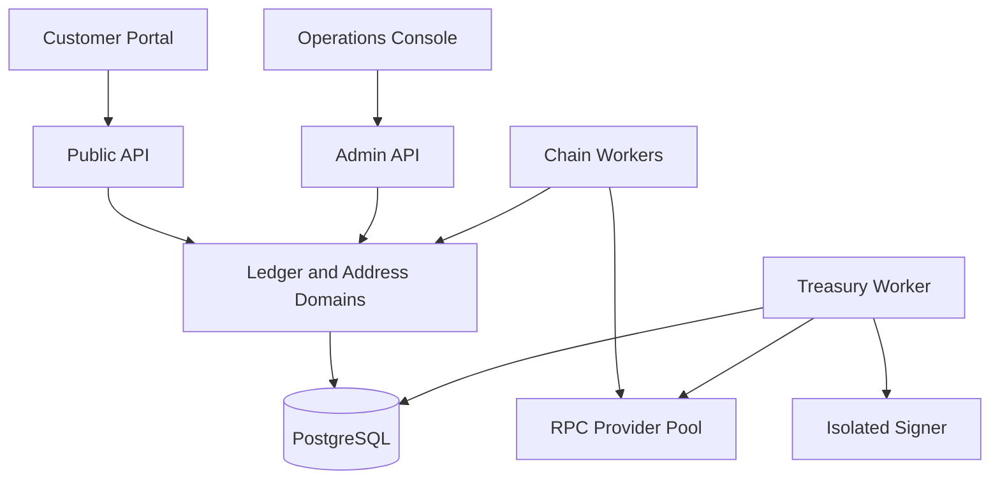

# Antigravity Master Build Prompt — AegisPay Crypto Gateway

Use the text between **START OF PROMPT** and **END OF PROMPT** as the master prompt in Antigravity. The product name `AegisPay` is a placeholder and may be renamed.

---

## START OF PROMPT

You are the principal software architect, senior fintech backend engineer, blockchain integration engineer, security engineer, DevOps engineer, product designer, and QA lead for this project.

Build **AegisPay**, a production-oriented, custodial, multi-network crypto deposit and settlement gateway for a trading platform. It must include a polished customer GUI, a separate operations/admin GUI, a separately deployed secure backend, chain-monitoring workers, an isolated transaction-signing boundary, an immutable double-entry ledger, automated treasury sweeps, reconciliation, and a plug-in architecture for adding networks and tokens later.

This is real financial infrastructure, not a demo CRUD application. However, **all generated environments must default to local development and public testnets only**. Mainnet support must remain disabled behind an explicit production-readiness gate. Never generate, print, store, or commit real seed phrases or private keys. Never claim the application is production-ready until the listed security, legal, audit, reconciliation, and disaster-recovery gates are completed by qualified humans.

### 1. Product outcome

Create a secure platform in which:

1. A user registers and verifies their identity.
2. The platform creates a logical multi-asset wallet account for that user.
3. The platform automatically allocates one deposit address per enabled blockchain network for that user. Tokens on the same account-based network share that network address; do not create a separate EVM address for every ERC-20 token.
4. The user selects an asset and its exact network, sees an address and QR code, and sends funds.
5. Chain workers detect the transfer, validate the exact contract/network, wait for the configured finality policy, and record it idempotently.
6. A balanced ledger journal credits the user's **Funding Balance**.
7. The user—or an optional policy—moves a specified amount from Funding Balance to **Trading Balance** as an instantaneous internal ledger transfer. This is not an on-chain transaction.
8. A separate treasury workflow sweeps the actual on-chain funds from the assigned deposit address to an operator-controlled vault/cold-wallet address after fee and risk checks.
9. The treasury sweep must never debit or otherwise reduce the user's Funding or Trading Balance.
10. Admins can monitor deposits, confirmations, sweeps, withdrawals, hot/cold balances, gas, reconciliation, risk holds, provider health, and immutable audit history.

The first complete acceptance scenario is:

- A verified user receives a TRON testnet address.
- The user deposits `10.000000` units of a six-decimal **mock TRC-20 stablecoin** on Nile or Shasta. Never label an unofficial test token as real USDT or USDC.
- The UI first shows `Detected / Confirming` and does not make the funds spendable.
- After TRON solidification and successful receipt validation, exactly `10_000_000` atomic units are credited once to Funding Balance.
- With auto-allocation enabled, exactly `10_000_000` atomic units move from Funding Balance to Trading Balance through a separate balanced journal.
- A sweep job transfers the token to the configured testnet treasury-vault address using the TRON resource/gas policy.
- After the sweep finalizes, the user's Trading Balance remains exactly `10.000000`.
- Replaying the same block, log, webhook, or job any number of times cannot create a second credit or a second sweep.

### 2. Mandatory terminology and corrections

Keep these concepts separate everywhere—in code, database schema, API naming, logs, and UI:

- **Asset:** the economic asset, such as USDC, USDT, ETH, BNB, or TRX.
- **Network:** the blockchain, such as Ethereum, BNB Smart Chain, or TRON.
- **Asset-network:** one exact representation of an asset on one exact network, identified by chain/network ID and, for tokens, an allowlisted contract address and immutable decimals.
- **Logical wallet balance:** the platform's internal accounting liability to a user.
- **Deposit address:** an on-chain address assigned to a user for a network.
- **Funding Balance:** confirmed user funds not yet assigned to the trading engine.
- **Trading Balance:** funds internally allocated for trading.
- **Hot wallet:** limited online liquidity used for approved withdrawals and gas/resource operations.
- **Treasury vault/cold wallet:** an operator-controlled receiving address whose private key is never present in any online service.
- **Sweep:** an on-chain movement between platform-controlled locations. It does not change user liabilities.
- **Binance Pay:** an off-chain/merchant payment rail with orders and authenticated notifications.
- **BNB Smart Chain:** an EVM-compatible blockchain. It is not the same integration as Binance Pay.

Do **not** implement or advertise USDC on TRON. Circle stopped minting USDC on TRON in 2024 and ended its transition support. Seed the initial product with:

- TRON: TRX and, only after an exact official contract review, USDT TRC-20 for mainnet; use a mock six-decimal TRC-20 on testnet.
- Ethereum: ETH plus allowlisted ERC-20 assets such as native USDC/USDT after official contract verification.
- BNB Smart Chain: BNB plus allowlisted BEP-20 assets after official contract verification.
- Optional Binance Pay: a separate payment-rail adapter, disabled unless valid merchant credentials and approval exist.

Never identify a token by symbol or name. Match the configured network plus exact contract/account identifier. Treat bridged assets as different asset-network records unless explicitly approved.

### 3. Safety and scope rules

These rules are non-negotiable:

- Default to local chains/testnets. `MAINNET_ENABLED=false` must be the default and test fixtures must assert it.
- Never put private keys, mnemonics, raw signing material, API secrets, or recovery shares in source code, browser code, PostgreSQL, Redis, logs, analytics, crash reports, Docker images, CI output, or ordinary environment files.
- Do not invent cryptographic algorithms, address derivation, transaction serialization, signature logic, or password hashing. Use maintained, audited standards and libraries behind narrowly defined ports.
- “Unique backend code” means original domain modeling, ledger logic, idempotency, workflows, policies, adapter contracts, reconciliation, APIs, and UI—not custom cryptography.
- The cold-wallet private key must never be online. Online systems store only its allowlisted public address.
- A dedicated signer service must be separately deployed, network-isolated, mutually authenticated, policy-constrained, and referenced using opaque key IDs/derivation paths. Provide a safe mock signer for local/testnet development. Production must use an approved HSM, MPC, or institutional custody integration.
- Do not let the public API, admin API, scanners, or database return raw signing material.
- PostgreSQL is the source of truth for money and workflow state. Redis, queues, caches, providers, webhooks, and blockchain WebSockets are never accounting sources of truth.
- Store and calculate crypto amounts as atomic-unit integers. Use `bigint` internally and decimal strings at API boundaries. Never use JavaScript `number`, floating-point SQL types, or binary floating-point arithmetic for money.
- Credit only a successful, exact, allowlisted transfer at the required finality. A pending visual indicator is allowed, but pending funds cannot be traded or withdrawn.
- Every external event and command must be idempotent.
- A user balance must never be directly edited. Corrections require a new compensating journal with an actor, reason, approval, and audit record.
- Do not auto-recover unsupported assets, wrong-network transfers, tokens below minimum, blacklisted funds, or ambiguous transfers. Put them into a manual-review workflow.
- Do not implement automatic bridges, swaps, yield, staking, leverage, or asset conversion in the gateway.
- Do not turn on withdrawals or mainnet because tests pass. Both require explicit human approval gates.
- Add conspicuous documentation that operating a custodial crypto service may require licenses/registrations, KYC/KYB, AML and sanctions controls, transaction monitoring, Travel Rule support, tax/accounting treatment, privacy controls, consumer disclosures, and jurisdiction-specific legal review.

### 4. Recommended technology stack

Use current stable, mutually compatible releases at implementation time and pin exact versions in lockfiles and container images. Do not blindly use a version named in this prompt if it is no longer supported.

#### Customer and admin frontends

- Next.js with App Router, React, strict TypeScript
- Tailwind CSS and shadcn/ui primitives
- TanStack Query for server state
- React Hook Form plus Zod for forms and shared API validation
- Zustand only for small client-only UI state; money state always comes from the backend
- Recharts for operations charts
- `next-intl`-ready message structure
- Playwright for end-to-end testing
- Vitest and Testing Library for component tests
- Generated OpenAPI client; frontends must not import backend implementation code

#### Backend and workers

- Node.js current LTS, strict TypeScript, NestJS with the Fastify adapter
- REST/JSON public and admin APIs with OpenAPI 3.1; version all endpoints under `/v1`
- PostgreSQL with explicit SQL migrations and Kysely (or an equally transparent type-safe SQL layer). The ledger-critical transaction code must use explicit SQL, transaction isolation, row locking, and database constraints—not opaque ORM magic.
- Redis only for rate limits, short-lived cache, and coordination hints; never balances or authoritative job state
- PostgreSQL transactional outbox and inbox for durable events
- A durable workflow mechanism for confirmations, sweeps, withdrawals, and retries. Prefer Temporal if the environment can operate it; otherwise build a PostgreSQL-backed worker state machine using `FOR UPDATE SKIP LOCKED`, leases, heartbeats, bounded retries, and dead-letter/manual-review states. Do not use a memory-only queue.
- `ethers` for generic EVM RPC and transaction handling
- `TronWeb` plus official TRON HTTP/RPC semantics for TRON
- OpenTelemetry traces, Prometheus metrics, structured JSON logs, and an error tracker with aggressive secret/PII redaction
- Docker Compose for local development and Terraform modules for deployment

#### Security and identity

- Standards-based OIDC/OAuth identity provider or well-reviewed self-hosted identity service; do not create a home-grown authentication protocol
- Passkeys/WebAuthn where available, TOTP fallback, recovery codes, session/device management
- Mandatory phishing-resistant MFA for treasury, security, and super-admin roles
- Argon2id only if local password credentials are genuinely required
- mTLS between sensitive backend services and the signer
- Cloud secret manager for ordinary application secrets; HSM/MPC/custody boundary for signing keys
- Envelope encryption for PII, key rotation, separate encryption contexts, and least-privilege IAM

### 5. Deployment separation

Create separate build and deployment units. They may live in one development workspace, but they must not run as one production process.

```text
/apps/customer-portal       # public user GUI
/apps/operations-console    # private admin/compliance/treasury GUI
/services/public-api        # customer-facing API/BFF boundary
/services/admin-api         # separately exposed admin API
/services/core-ledger       # ledger and balance domain
/services/address-service   # watch-only address allocation
/services/chain-workers     # block scanners and normalized transfer ingestion
/services/treasury-worker   # gas top-ups, sweeps, reconciliation
/services/withdrawal-worker # disabled by default
/services/signer            # isolated signing port; mock locally, HSM/MPC in production
/packages/chain-sdk         # adapter contracts and conformance suite
/packages/adapter-evm       # Ethereum and EVM-compatible networks
/packages/adapter-tron      # TRON
/packages/rail-binance-pay  # optional, separate from BSC
/packages/api-client        # generated client for frontends/integrators
/packages/ui                # frontend-only design system
/infra                      # Docker Compose, Terraform, policies, dashboards
/docs                       # ADRs, threat model, runbooks, API and operations docs
```

Production network rules:

- Customer portal, operations console, public API, and admin API use separate origins.
- Admin access is behind identity-aware access, MFA, IP/device policy, and short sessions.
- Databases, Redis, workers, node RPC credentials, and signer are never publicly reachable.
- The public API cannot call the signer directly.
- The signer cannot query customer PII or mutate ledger tables.
- The signer accepts only a typed, policy-checked signing request tied to a persisted transaction intent and returns a signature/signed payload plus attestation metadata.
- Separate IAM roles, security groups, secrets, audit streams, and deployment permissions by service.
- Use TLS everywhere and mTLS for signer/treasury paths.

### 6. High-level architecture



Use a **modular-monolith-first domain core** with separately deployable workers and signer. Do not split every table into a separate network service merely to appear scalable. Enforce module boundaries in code, use outbox events between asynchronous domains, and keep the option to extract services when load or organizational ownership requires it.

### 7. Domain boundaries

Implement these bounded modules:

1. **Identity and Access** — user identity reference, account state, roles, MFA assurance, sessions, device/risk signals.
2. **Compliance** — KYC/KYB state, sanctions status, jurisdiction, transaction-risk decisions, case management, manual holds. Use provider interfaces so vendors are replaceable.
3. **Network Registry** — chain families, networks, RPC pools, finality policies, explorer templates, health state, maintenance state.
4. **Asset Registry** — assets, asset-network representations, token identifiers/contracts, decimals, deposit/sweep/withdrawal policy, enablement state.
5. **Address Management** — derivation index allocation, address normalization, watch-only derivation, user/network assignment, address state.
6. **Chain Ingestion** — cursors, canonical blocks, normalized transfers, receipts, finality, reorg/solidification behavior, provider failover.
7. **Deposits** — transfer matching, validation, confirmation state, crediting, exception handling.
8. **Ledger** — immutable journals, entries, logical accounts, holds, available/pending/locked projections.
9. **Trading Allocation** — internal Funding-to-Trading and Trading-to-Funding journals and events for the trading engine.
10. **Treasury** — gas/resource management, sweeping, hot-wallet liquidity, cold-vault allowlists, transaction intents.
11. **Withdrawals** — requests, balance reservation, policy/risk approvals, address allowlists, signing, broadcast, finalization, cancellation/failure compensation. Keep disabled initially.
12. **Reconciliation** — chain-to-event, event-to-deposit, deposit-to-ledger, and ledger-to-on-chain asset checks.
13. **Notifications and Webhooks** — user notices, trading-engine events, merchant/integrator webhooks, retry and replay controls.
14. **Audit** — append-only actor/action/resource history, approval evidence, before/after hashes, correlation IDs.

### 8. Plug-in network architecture

Design for three levels of extension:

| Addition | Expected work |
|---|---|
| New token on an already-supported network | Add a reviewed asset-network manifest, verify exact contract and decimals, run conformance and fork/testnet tests, obtain approval. No domain-code change. |
| New EVM-compatible network | Add a network manifest, RPC/finality/gas/explorer policy, then run the generic EVM adapter conformance suite. No ledger or deposit-domain change. |
| New chain family such as Bitcoin/UTXO, Solana, or XRP | Implement a new adapter package and signing codec against the stable adapter interfaces, then pass the complete conformance suite. No edits to ledger/business workflows. |

Do not force UTXO and account-based chains into assumptions they do not share. Expose adapter **capabilities** and family-specific policy types.

Create stable TypeScript contracts similar to the following, refining them as needed without leaking SDK-specific types into the domain:

```ts
export type NetworkId = string;
export type AssetNetworkId = string;
export type AtomicAmount = string; // canonical unsigned base-10 integer at boundaries

export type Finality =
  | { status: 'observed'; confirmations: number }
  | { status: 'safe'; confirmations: number }
  | { status: 'finalized'; confirmations: number };

export interface NormalizedTransfer {
  eventId: string;
  networkId: NetworkId;
  assetNetworkId: AssetNetworkId;
  txHash: string;
  blockHash: string;
  blockHeight: string;
  eventIndex: string;
  fromAddress: string;
  toAddress: string;
  amountAtomic: AtomicAmount;
  executionSucceeded: boolean;
  finality: Finality;
  observedAt: string;
  rawReferenceHash: string;
}

export interface ChainAdapter {
  readonly family: string;
  readonly capabilities: ReadonlySet<
    | 'native-transfer'
    | 'token-transfer'
    | 'finalized-tag'
    | 'memo-tag'
    | 'fee-estimation'
    | 'resource-delegation'
    | 'transaction-replacement'
  >;

  validateNetwork(config: NetworkManifest): Promise<void>;
  normalizeAddress(address: string, network: NetworkManifest): string;
  validateAddress(address: string, network: NetworkManifest): boolean;
  deriveWatchAddress(input: WatchDerivationInput): Promise<DerivedAddress>;
  getFinalizedCursor(network: NetworkManifest): Promise<ChainCursor>;
  scanRange(input: ScanRangeInput): AsyncIterable<NormalizedTransfer>;
  getTransactionStatus(input: TransactionLookup): Promise<TransactionStatus>;
  getBalance(input: BalanceLookup): Promise<AtomicAmount>;
  estimateTransferFee(input: UnsignedTransferIntent): Promise<FeeEstimate>;
  buildUnsignedTransfer(input: UnsignedTransferIntent): Promise<UnsignedPayload>;
  broadcastSignedTransfer(input: SignedPayload): Promise<BroadcastResult>;
  reconcileAddress(input: ReconcileAddressInput): Promise<ReconcileResult>;
}

export interface SignerPort {
  getPublicMaterial(keyRef: string): Promise<PublicMaterial>;
  signApprovedIntent(request: ApprovedSigningRequest): Promise<SigningResult>;
}
```

Adapter requirements:

- No adapter can write ledger entries directly.
- No adapter can decide user credit amounts.
- No adapter receives raw private keys.
- All returned addresses, hashes, amounts, block identifiers, and event indices are normalized deterministically.
- Every adapter ships fixtures, malformed-input tests, idempotency fixtures, provider-failure tests, and a conformance test suite.
- Plugins are loaded from an explicit signed/allowlisted registry at build/deploy time, not arbitrary runtime code uploaded by an admin.
- Network and asset configuration changes require validation, audit, versioning, and dual approval before production activation.

Create versioned YAML or JSON manifests for networks and asset-networks. A network manifest includes:

- stable internal ID and display name
- family and environment (`local`, `testnet`, `mainnet`)
- numeric/textual chain ID and a startup chain-identity assertion
- native fee asset
- RPC endpoint references by secret ID, priority, and capability—not credentials
- confirmation/finality policy
- scanner start height and chunk policy
- address format and derivation policy reference
- explorer templates
- gas/resource limits
- maintenance and circuit-breaker settings

An asset-network manifest includes:

- stable internal ID and parent economic asset ID
- network ID
- type (`native`, `erc20`, `trc20`, or future family type)
- exact contract/token identifier where applicable
- immutable decimals after activation
- minimum deposit, credit policy, sweep threshold, withdrawal minimum, fee policy
- required compliance/risk policy
- official source/review evidence and reviewer
- testnet/mainnet status

### 9. Address and key model

For account-based chains, allocate one reusable deposit address per user per network unless a future rotation policy explicitly creates a new version. Multiple tokens on the same network use that network address.

Implement watch-only derivation where supported:

- Production root material is created during an audited key ceremony in an HSM/MPC/custody system, never by an ordinary API request.
- Address Service receives only the minimum public derivation material needed to derive deposit addresses.
- Store `key_ref`, derivation policy/version, derivation index, normalized address, display address, user ID, network ID, and lifecycle state.
- Allocate indices inside a serializable database transaction with a unique constraint so concurrent signup cannot reuse an index.
- Treat extended public keys as sensitive operational data even though they cannot spend funds; encrypt and access-control them.
- Use independent roots/policies for EVM and TRON. Never silently reuse a derivation namespace across networks.
- The Signer resolves an approved `key_ref + derivation path` inside its boundary and never returns private material.
- In local development, use deterministic disposable test seeds stored outside source control and visibly marked `TEST ONLY`.

Alternative managed-custody address creation may be implemented behind the same Address Provider and Signer ports. Do not couple domain code to one custody vendor.

Cold-vault rules:

- Store only the cold-vault public address in the online system.
- A cold-vault address change is a high-risk configuration change requiring two different authorized approvers, MFA, an out-of-band verification ceremony, an activation delay, and immutable audit evidence.
- Display full address, network, checksum/format result, and a verification fingerprint to approvers.
- Never allow the destination to be changed as part of an individual sweep job.

### 10. Ledger design

Implement an immutable, multi-asset double-entry ledger in PostgreSQL. It must be the only source for user balances.

Core account classes include:

- `asset:onchain:deposit:<network>:<asset-network>`
- `asset:onchain:hot:<network>:<asset-network>`
- `asset:onchain:cold:<network>:<asset-network>`
- `liability:user:<user>:funding:<asset>`
- `liability:user:<user>:trading:<asset>`
- `liability:user:<user>:locked:<asset>`
- `expense:network-fees:<network>:<asset>`
- `revenue:service-fees:<asset>`
- explicit suspense and recovery accounts with restricted use

Required tables include at minimum:

- `ledger_accounts`
- `ledger_transactions`
- `ledger_entries`
- `balance_snapshots` as a rebuildable performance projection, never the authority
- `balance_holds`
- `idempotency_keys`
- `outbox_events`
- `inbox_events`

Ledger rules:

- Every journal has at least two entries.
- Debits equal credits for each economic asset within a journal. Cross-asset conversions are represented by linked journals and an explicit trade/price record from the trading engine, never an unbalanced journal.
- Enforce balancing through a deferred database constraint trigger or a single restricted ledger-posting database function plus application invariants.
- Posted journals and entries cannot be updated or deleted by application roles.
- Use serializable transactions or explicit row locks for balance-sensitive operations.
- Each command has a unique idempotency key scoped to actor/operation.
- Each on-chain credit has a unique constraint equivalent to `(network_id, tx_hash, event_index, asset_network_id)`.
- Store amount as an integer-compatible numeric/string representation that supports the largest target chain range. No floating point.
- Store asset decimals in registry metadata, not on every calculation path, and never alter activated decimals.
- Return a balance only from posted entries minus active holds; clearly separate `pending`, `available`, `trading`, and `locked`.
- A correction is a compensating transaction linked to the original journal.

Example journals for a confirmed 10-unit deposit:

1. Deposit credit:
   - Debit `asset:onchain:deposit:tron:<token>` by `10_000_000` atomic units.
   - Credit `liability:user:<id>:funding:<asset>` by `10_000_000` atomic units.
2. Funding-to-Trading transfer:
   - Debit `liability:user:<id>:funding:<asset>` by `10_000_000` atomic units.
   - Credit `liability:user:<id>:trading:<asset>` by `10_000_000` atomic units.
3. Treasury sweep after finalization:
   - Debit `asset:onchain:cold:tron:<token>` by the swept token amount.
   - Credit `asset:onchain:deposit:tron:<token>` by the swept token amount.
   - Record network fee/resource consumption in a separate fee journal denominated in the fee asset.
   - Do not touch either user liability account.

If the accounting library uses the opposite sign convention, document it clearly while preserving the economic effect and balance invariant.

### 11. Minimum database model

Create normalized migrations for at least:

- `users`, `user_profiles`, `user_security_state`, `user_compliance_state`
- `roles`, `permissions`, `user_roles`, `admin_approval_requests`
- `networks`, `network_config_versions`, `rpc_endpoints`, `network_health`
- `assets`, `asset_networks`, `asset_policy_versions`
- `key_references`, `derivation_counters`, `deposit_addresses`
- `chain_cursors`, `chain_blocks`, `chain_events`, `provider_observations`
- `deposits`, `deposit_state_history`, `deposit_exceptions`
- `ledger_accounts`, `ledger_transactions`, `ledger_entries`, `balance_holds`, `balance_snapshots`
- `trading_transfers`
- `treasury_wallets`, `treasury_address_versions`, `gas_topups`, `transaction_intents`
- `sweep_jobs`, `sweep_attempts`, `signing_requests`
- `withdrawal_requests`, `withdrawal_approvals`, `withdrawal_attempts`, `address_allowlist`
- `reconciliation_runs`, `reconciliation_items`, `reconciliation_breaks`
- `webhook_endpoints`, `webhook_deliveries`, `notification_deliveries`
- `idempotency_keys`, `inbox_events`, `outbox_events`, `audit_events`

Add foreign keys, partial unique indexes, state checks, monotonic versioning, created timestamps, actor/correlation IDs, and safe optimistic or pessimistic concurrency controls. Financial tables must not use cascade delete. Prefer soft lifecycle states for domain records and append-only history for state changes.

### 12. Deposit ingestion workflow

Build the scanner as a resumable, range-based pipeline, not a fragile collection of address polling loops.

General algorithm:

1. On startup, query and verify the actual chain/network ID from every configured provider. Disable the provider on mismatch.
2. Maintain a durable cursor per network and scanner version.
3. Query the adapter's safe/finalized/solidified height according to the configured policy.
4. Scan deterministic ranges with bounded adaptive chunk sizes.
5. Normalize all candidate transfers into `NormalizedTransfer` records.
6. Persist raw-reference hashes and provider observations for forensic comparison without putting secrets in raw payloads.
7. Match only against active assigned deposit addresses and active exact asset-network identifiers.
8. Verify transaction execution success and required finality.
9. Insert the chain event and deposit idempotently.
10. Run compliance/transaction-risk policy.
11. Post the deposit-credit journal exactly once or place the deposit on hold/manual review.
12. Emit `deposit.confirmed`, `balance.credited`, and optionally `trading_allocation.requested` through the transactional outbox.
13. Advance the durable cursor only after the range is fully committed.

WebSockets and provider webhooks may reduce latency but are only hints. The range scanner is the recovery/source-of-truth path. Support two independent RPC providers per production network, provider health scoring, exponential backoff with jitter, rate-limit handling, and circuit breakers. Never credit the same transfer based on two providers twice.

Deposit states:

```text
OBSERVED -> CONFIRMING -> FINALIZED -> RISK_CHECK -> CREDITED
                                     -> HELD
                                     -> MANUAL_REVIEW
OBSERVED/CONFIRMING -> ORPHANED (only where the network can reorganize before finality)
```

Keep display status separate from posting status. Store state transitions append-only.

#### EVM behavior

- Implement Ethereum and BNB Smart Chain through the generic EVM adapter with network-specific finality configuration.
- Use exact numeric chain IDs and check them at startup and periodically.
- Detect ERC-20/BEP-20 transfers from allowlisted contract `Transfer` logs. Verify receipt success, topics, indexed recipient, data length, amount, block hash, and canonical/finalized membership.
- Use `eth_getLogs` range scans with adaptive range sizing and deterministic cursors. Handle provider result limits.
- Do not trust token `symbol`, `name`, or user-supplied contract metadata.
- Query decimals during the asset onboarding review, compare with official evidence, then freeze them in the approved registry.
- Support direct top-level native-coin deposits initially. Contract-internal native transfers require a provider/node tracing capability; either implement and test that capability or explicitly mark such deposits unsupported/manual-review. Never pretend ordinary transaction lists detect every internal transfer.
- Model nonce ownership and replacement policy explicitly for outgoing EVM transactions.
- Prefer the network's finalized/safe semantics when reliable; otherwise use a reviewed configurable finality rule. Do not use one hard-coded confirmation count for every EVM network.
- Persist block hashes and support pre-finality reorg repair.

#### TRON behavior

- Normalize both user-facing Base58Check `T...` addresses and wire-level hex `41...` addresses to one deterministic internal representation while preserving a safe display form.
- For hosted access, support TronGrid with authenticated rate-limit handling. For self-hosting, support full-node/solidity-node range parsing.
- Parse solidified blocks, not only chain head, for the crediting path.
- For TRC-20 transfers, verify the smart-contract transaction succeeded, decode every relevant `Transfer` event, match the exact allowlisted token contract and recipient, and process multiple events in one transaction using stable event indices.
- Skip failed receipts and rejected internal transactions.
- Model TRON Bandwidth/Energy and `fee_limit`; do not treat it as EVM gas with renamed fields.
- Implement resource delegation or bounded TRX gas top-up as a configurable treasury strategy. Query/estimate required resources and cap every top-up.
- Keep the TRON scanner/provider code behind the same normalized adapter contract while retaining TRON-specific tests.

#### Binance integrations

- BNB Smart Chain uses the EVM adapter.
- Binance Pay, if added, uses an independent `PaymentRailAdapter`. It creates merchant orders/QR payloads, verifies Binance's current authenticated webhook/notification rules, enforces timestamp/replay protection and idempotency, and queries order status for reconciliation.
- Do not generate a blockchain deposit address through the Binance Pay adapter.
- Do not assume Binance merchant access exists; show `NOT_CONFIGURED` until onboarding and credentials are completed.

### 13. Trading allocation workflow

Implement Funding Balance and Trading Balance as separate ledger accounts, not columns that can drift.

- `POST /v1/internal-transfers` accepts `from=FUNDING`, `to=TRADING`, asset ID, amount decimal string, and an `Idempotency-Key`.
- Validate positive amount, asset state, available balance, user status, risk holds, and trading account status.
- Convert the API decimal string to atomic units using immutable asset decimals and reject excess precision.
- Post both entries in one database transaction.
- Emit a versioned `trading.balance.allocated.v1` outbox event.
- The trading engine consumes the event idempotently using event ID and returns/records an acknowledgement.
- If `auto_allocate_confirmed_deposits=true`, request the allocation only after the deposit-credit journal commits. Do not combine deposit and allocation into an ambiguous single state.
- If allocation fails, funds remain safely visible in Funding Balance and the job can retry.

### 14. Treasury sweep workflow

Sweeps are asynchronous durable jobs with a state machine:

```text
ELIGIBLE -> FEE_ESTIMATED -> RESOURCE_READY -> INTENT_CREATED
         -> POLICY_APPROVED -> SIGNING -> SIGNED -> BROADCAST
         -> CONFIRMING -> FINALIZED -> RECONCILED
Any non-final state -> RETRY_SCHEDULED / MANUAL_REVIEW / CANCELLED_BY_POLICY
```

Eligibility considers:

- deposit finalized and credited/held according to policy
- exact address/token balance from the chain
- minimum economical sweep threshold
- maximum allowed value left at a deposit address
- time-based sweep deadline
- fee/resource cost and native fee balance
- network/provider health
- sanctions/risk hold policy
- configured cold-vault address version

Implement:

- deterministic sweep job identity so one deposit/address balance window cannot create duplicate active jobs
- fee estimation with maximum caps and stale-quote expiry
- EVM native fee top-ups from a tightly limited gas-station wallet where required
- TRON resource delegation or limited TRX top-up
- gas top-up idempotency, per-address/day caps, and dust tracking
- policy engine checks before signing
- opaque signing request with intent hash, network, source key reference, destination allowlist reference, asset, amount, fee cap, expiry, and correlation ID
- post-signature verification that the returned signed transaction exactly matches the approved intent before broadcast
- broadcast ambiguity handling: query by deterministic tx hash before retrying
- nonce/sequence management and replacement rules where applicable
- finality monitoring and on-chain balance reconciliation
- ledger asset-location journal after finalization
- alerts for stuck, over-fee, underfunded, wrong-destination, provider-disagreement, and reconciliation-break states

Never sweep an unrecognized token. Never let an admin type a sweep destination into a job. Sweeping every tiny deposit may cost more than it moves, so make threshold, time, and maximum-exposure policies configurable.

### 15. Withdrawal workflow

Build only after deposits, ledger, sweeps, and reconciliation pass. Keep `WITHDRAWALS_ENABLED=false` by default.

Withdrawal states:

```text
REQUESTED -> MFA_VERIFIED -> FUNDS_RESERVED -> RISK_CHECKED
          -> APPROVAL_PENDING -> INTENT_CREATED -> SIGNED -> BROADCAST
          -> CONFIRMING -> FINALIZED -> SETTLED
Any pre-broadcast state -> REJECTED / CANCELLED / EXPIRED / FUNDS_RELEASED
Post-broadcast abnormal state -> MANUAL_REVIEW
```

Requirements:

- network-specific address validation and network mismatch warnings
- optional address allowlist with a security cooldown
- step-up MFA
- per-user, per-asset, per-network, per-hour/day velocity limits
- account takeover signals and recent-security-change cooldowns
- compliance, sanctions, and blockchain-risk provider interfaces
- withdrawal fee quote with expiry and exact display of gross, fee, and net
- atomic reservation from available to locked balance
- maker-checker approval above thresholds; no actor approves their own request
- hot-wallet liquidity policy; never automatically sign from the cold wallet
- signed-intent verification, broadcast, finality, and settlement journal
- compensating release journal if a pre-broadcast request fails or is rejected
- no automatic “refund” to a new address based on an inbound transaction sender

### 16. API design

Generate OpenAPI 3.1 and a typed client. Use consistent error objects, correlation IDs, cursor pagination, RFC 3339 timestamps, atomic decimal-string amounts, and idempotency.

Minimum customer endpoints:

```text
POST   /v1/users/onboarding
GET    /v1/account
GET    /v1/assets
GET    /v1/networks
GET    /v1/asset-networks
POST   /v1/deposit-addresses/ensure
GET    /v1/deposit-addresses
POST   /v1/deposit-intents
GET    /v1/deposits
GET    /v1/deposits/:id
GET    /v1/balances
POST   /v1/internal-transfers
GET    /v1/internal-transfers
POST   /v1/withdrawals
GET    /v1/withdrawals
GET    /v1/transactions
GET    /v1/security/sessions
DELETE /v1/security/sessions/:id
```

Minimum admin endpoints, on the separately protected admin API:

```text
GET    /v1/admin/overview
GET    /v1/admin/users
GET    /v1/admin/users/:id
POST   /v1/admin/users/:id/hold
POST   /v1/admin/users/:id/release
GET    /v1/admin/deposits
GET    /v1/admin/deposit-exceptions
POST   /v1/admin/deposit-exceptions/:id/resolve
GET    /v1/admin/sweeps
POST   /v1/admin/sweeps/:id/retry
GET    /v1/admin/withdrawals
POST   /v1/admin/withdrawals/:id/approve
POST   /v1/admin/withdrawals/:id/reject
GET    /v1/admin/treasury
GET    /v1/admin/gas
GET    /v1/admin/reconciliation
POST   /v1/admin/reconciliation/run
GET    /v1/admin/networks
POST   /v1/admin/networks/:id/pause
POST   /v1/admin/config-change-requests
POST   /v1/admin/config-change-requests/:id/approve
GET    /v1/admin/audit-events
```

Integrator/trading-engine events:

```text
deposit.observed.v1
deposit.finalized.v1
balance.credited.v1
trading.balance.allocated.v1
sweep.finalized.v1
withdrawal.requested.v1
withdrawal.finalized.v1
risk.hold.created.v1
reconciliation.break.detected.v1
```

Webhooks must be HMAC-signed with key IDs, timestamp and delivery ID, reject stale/replayed requests, retry with exponential backoff, expose delivery history, and support secret rotation with overlap. Consumers must deduplicate by event ID.

### 17. Customer GUI

Create an institutional, trustworthy interface—not a casino-style crypto dashboard. It must be polished on desktop and mobile, support dark and light modes, meet WCAG 2.2 AA, and contain complete loading, empty, success, error, offline, stale-data, and permission states.

Visual direction:

- Deep navy/graphite base, high-contrast neutral surfaces, restrained emerald for success and amber/red for warnings
- Minimal gradient use; no glowing coin wallpaper or speculative imagery
- Clear typography using Geist or Inter
- Tabular numerals for balances
- Consistent 8px spacing grid, 12–16px radii, subtle borders, accessible focus rings
- Network icons are secondary to written network names; never rely on icon/color alone
- Always show asset **and network** together, such as `USDT · TRON (TRC-20)`

Customer pages:

1. Registration, login, passkey/MFA, email verification, identity-verification status.
2. Dashboard with Total Portfolio, Funding Balance, Trading Balance, Pending Deposits, and recent activity.
3. Wallets page grouped by asset with separate network availability.
4. Deposit flow:
   - choose asset
   - choose exact network
   - show strong wrong-network warning
   - show QR code and copyable address
   - show memo/tag if the future network needs one
   - show minimum, expected finality, fee policy, enabled/maintenance status
   - allow an optional expected amount/deposit intent
   - live timeline: Waiting, Detected, Confirming, Finalized, Credited, Sweeping
   - clearly explain that Sweeping is treasury movement and does not remove the user's balance
5. Transfer to Trading dialog with Funding available, exact amount, Max button, validation, review, MFA if policy requires, and success receipt.
6. Withdraw flow, visible but disabled with a clear explanation until enabled.
7. Transaction history with filters for deposits, internal transfers, trades integration events, withdrawals, fees, and adjustments.
8. Security center with passkeys/MFA, devices, active sessions, withdrawal allowlist, and security cooldowns.
9. Notification center and support/recovery guidance.

Deposit UX safety:

- Never show an address without the network name in the same visual block.
- Require acknowledgement when two similarly named networks/assets exist.
- Copy button copies only the address and confirms the first/last characters.
- QR payload must be verified against the displayed address by a unit test.
- Show truncated addresses in tables but full addresses in a secure detail view.
- Show explorer links only from trusted templates in the network registry.

### 18. Operations/admin GUI

Build a separate operations console for support, compliance, treasury, security, and audit roles. Apply field-level permissions and redact sensitive PII unless the role and case require it.

Pages:

- Overview: confirmed volume, pending deposits, scanner lag, sweep backlog, withdrawal queue, provider health, gas status, reconciliation status, hot-wallet exposure.
- Users: identity/KYC state, balances, holds, addresses, activity, cases, security events.
- Deposits: network/asset/status filters, confirmation timeline, exact event identity, ledger journal link, exception queue.
- Treasury: deposit/hot/cold balances, exposure policy, sweep jobs, gas/resource top-ups, transaction intents.
- Withdrawals: risk score, approvals, address history, reservations, attempts, finality.
- Networks and assets: read-only active configuration plus versioned change-request workflow.
- Provider health: RPC lag, disagreement, error rate, rate-limit state, latest finalized height.
- Reconciliation: run history, breaks, severity, ownership, evidence, resolution journals.
- Compliance cases: holds and provider decisions with least-privilege detail.
- Audit: actor, action, request ID, approval chain, resource, timestamp, outcome, and tamper-evident hash chain/export.
- System controls: pause deposits, pause crediting, pause sweeps, pause withdrawals independently per network/asset. Emergency pause requires a reason and generates a critical audit/alert event.

Admin UX must never offer a raw “change balance” form, raw private-key field, arbitrary signing payload, arbitrary sweep destination, or one-click bypass of risk/finality.

### 19. Authentication, authorization, and application security

Implement:

- short-lived access tokens, rotated refresh sessions, secure HttpOnly/SameSite cookies where appropriate
- CSRF defense for cookie-authenticated mutations
- strict CORS allowlists per frontend origin
- CSP, HSTS, secure headers, clickjacking defense, MIME protection
- input validation at every trust boundary and canonical serialization for signed requests
- parameterized SQL only
- API rate limits by actor, IP, device, and endpoint risk
- bot/abuse protection on authentication and address generation
- RBAC plus contextual policy checks
- roles: `customer`, `support_read`, `support_write`, `compliance_analyst`, `compliance_approver`, `treasury_operator`, `treasury_approver`, `security_admin`, `auditor`, `super_admin`
- separation of duties: requestor cannot approve their own high-risk action
- immutable audit events for authentication changes, balance-affecting commands, approvals, config changes, signing, broadcast, pauses, and case resolution
- secret and PII redaction before log serialization
- dependency allowlist and lockfile integrity
- secure defaults and no debug endpoints in production

Produce a STRIDE-style threat model that includes:

- deposit replay/double credit
- chain reorganization or non-final credit
- fake token with copied symbol
- RPC compromise or chain-ID mismatch
- address substitution in UI/API
- signer compromise and arbitrary transaction signing
- admin account takeover and approval collusion
- gas-station drain
- nonce collision/replacement abuse
- webhook spoofing/replay
- ledger race/double spend
- database operator tampering
- secrets in logs/build artifacts
- supply-chain package compromise
- reconciliation blindness
- denial of service/scanner lag
- insider cold-address change

For each threat, document prevention, detection, response, residual risk, and responsible owner.

### 20. Compliance architecture

Do not hard-code a single country's legal assumptions. Add a jurisdiction-aware policy layer and provider ports:

```ts
interface IdentityVerificationProvider { /* KYC/KYB */ }
interface SanctionsScreeningProvider { /* person/address screening */ }
interface BlockchainRiskProvider { /* source/destination risk */ }
interface TravelRuleProvider { /* only when legally applicable */ }
interface CaseManagementPort { /* decisions and evidence */ }
```

Requirements:

- user/country/product eligibility rules
- KYC/KYB states and expiry/review dates
- sanctions and PEP screening decision references
- blockchain address/transaction risk decision references
- configurable holds and manual review
- record retention and deletion policies reconciled with financial/legal requirements
- consent, privacy notice, terms, fee disclosure, risk disclosure
- geofencing/feature restrictions by legal decision
- auditable reviewer decisions
- no raw third-party provider payloads exposed to normal support users

Add a production gate requiring written legal/compliance approval for each operating jurisdiction. In India or any other jurisdiction, do not infer that a software build alone authorizes custodial exchange/payment activity.

### 21. Reconciliation and invariants

Implement continuous and scheduled reconciliation:

1. **Chain cursor reconciliation:** no unexplained block gaps; block hashes consistent with finality policy.
2. **Event reconciliation:** every matched finalized chain event maps to exactly one deposit or an explicit exception.
3. **Deposit-ledger reconciliation:** every credited deposit maps to exactly one balanced journal of the same asset and amount.
4. **Sweep reconciliation:** source decrease, destination increase, fee, and job state match the finalized transaction.
5. **Custody reconciliation:** observed on-chain balances by location reconcile to ledger custody-asset accounts, accounting for in-flight transactions and fees.
6. **Liability reconciliation:** total user funding + trading + locked liabilities per asset match the corresponding liability control total.
7. **Solvency view:** controlled on-chain assets, approved off-chain custody assets if any, liabilities, in-flight movements, and breaks shown separately. Never hide a deficit through netting.

Hard invariants:

- A ledger journal balances per asset.
- A chain event credits at most once.
- An idempotent command has one economic result.
- An unfinalized/failed/unallowlisted transfer cannot become available balance.
- A sweep cannot alter user liabilities.
- A withdrawal cannot exceed available balance and cannot spend the same reservation twice.
- No signed payload can differ from its approved intent.
- No production network starts when chain identity, signer policy, asset registry, or reconciliation health checks fail.

Critical reconciliation breaks must automatically pause the affected crediting or withdrawal path according to severity and notify the correct on-call role.

### 22. Observability and operations

Instrument every request and workflow with a correlation ID. Use structured logs and OpenTelemetry across APIs, workers, providers, ledger posting, signing requests, and broadcasts.

Metrics/alerts include:

- latest head and finalized/solidified height by provider
- scanner lag and cursor age
- scanned blocks/events per minute
- provider error/rate-limit/disagreement rate
- deposits stuck by state and age
- time from observation to credit
- ledger posting failure and balance invariant failure
- sweep backlog, failure rate, gas/resource top-up volume
- gas-station and hot-wallet balance thresholds
- signing request rate, rejection, and policy mismatch
- broadcasts pending beyond expected finality
- withdrawals by state/risk/age
- reconciliation break count and value by asset
- emergency pause state

Provide dashboards and runbooks for provider outage, scanner lag, reorg, stuck transaction, gas exhaustion, hot-wallet depletion, signer outage, suspected key compromise, ledger mismatch, wrong cold address, webhook outage, and database restore.

Backups must use encryption, point-in-time recovery, restore tests, documented RPO/RTO, and restricted break-glass access. A backup that has never been restored in a test is not considered verified.

### 23. Testing strategy

Create a serious automated suite:

- Unit tests for decimal conversion, address normalization, policies, state machines, ledger journals, and signer-intent verification.
- Property-based tests for arbitrary large atomic amounts, precision rejection, debit/credit balance, idempotency, and concurrency invariants.
- Database integration tests with real PostgreSQL through Testcontainers.
- EVM adapter tests against Anvil/Hardhat plus public testnet smoke tests behind opt-in credentials.
- TRON adapter fixtures and opt-in Nile/Shasta smoke tests. Deploy a clearly named mock six-decimal TRC-20 for controlled test scenarios if needed.
- Contract/API tests generated from OpenAPI.
- Playwright tests for customer and admin critical paths.
- Security tests for authorization, CSRF, CORS, replay, rate limits, secret redaction, and approval separation.
- Chaos/recovery tests for duplicate events, out-of-order events, provider outage, provider disagreement, worker crash after ledger commit, crash before cursor advance, ambiguous broadcast, signer timeout, database failover, and chain reorg before finality.
- Load tests for signup/address allocation, block ingestion, ledger posting, and transaction history without weakening consistency.

Required regression scenarios:

1. Same ERC-20/TRC-20 event delivered 100 times produces one deposit and one credit.
2. Worker dies after posting the ledger journal but before acknowledging the job; restart produces no duplicate credit.
3. Two users created concurrently never receive the same derivation index/address.
4. Fake token with symbol `USDT` sent to a deposit address is detected as unsupported and not credited.
5. Failed contract execution is never credited.
6. Pre-finality reorg removes pending display and never creates available funds.
7. `10.000000` succeeds for a six-decimal asset; `10.0000001` is rejected.
8. A finalized deposit followed by sweep leaves user liability unchanged.
9. Wrong chain ID disables a provider.
10. Broadcast timeout followed by retry queries the transaction hash first and does not double-spend.
11. Cold-vault address change cannot be requested and approved by the same actor.
12. Ledger tables reject update/delete through the application role.

### 24. Local development and seed data

Provide:

- `docker compose up` for PostgreSQL, Redis, optional Temporal, observability, APIs, workers, and mock signer
- `.env.example` files containing names and safe placeholders only
- seed data for local/testnet networks, mock assets, roles, and demo users
- Anvil-based EVM test environment
- a documented TRON testnet fixture strategy
- one command to migrate/seed, one command to run all services, one command to run tests, and one command to run the acceptance scenario
- Mail/webhook sink for development
- fake KYC/risk providers that return explicit test decisions and can never be enabled in production

Every screen must work against real local APIs and database state. Do not hard-code dashboard numbers or return mocked success from production endpoints. An unconfigured external provider must return a typed `NOT_CONFIGURED`/feature-disabled result.

### 25. CI/CD and infrastructure

Create CI that runs:

- formatting, linting, strict typecheck
- unit, integration, property, API-contract, and UI tests
- migration validation and backward-compatibility checks
- secret scanning
- SAST and dependency/license scanning
- container and IaC scanning
- SBOM generation
- reproducible builds with pinned actions and dependencies
- signed container artifacts and provenance where available

Create environment promotion: local -> test -> staging/testnet -> production/mainnet. Production requires signed approvals and cannot share credentials/databases with test environments.

Infrastructure requirements:

- private subnets for data and signing services
- WAF/rate limiting at public edges
- managed PostgreSQL with Multi-AZ, encryption, PITR, and restricted roles
- no public Redis, database, worker dashboard, RPC credentials, or signer
- encrypted secrets and rotation procedures
- egress restrictions, especially for signer
- separate production deployment permissions
- immutable audit-log export to a restricted sink
- health, readiness, and graceful-shutdown behavior
- zero-downtime-compatible migrations using expand/migrate/contract strategy

### 26. Documentation deliverables

Generate and maintain:

- `README.md` with exact local setup and safe testnet workflow
- `docs/architecture.md`
- `docs/domain-model.md`
- `docs/ledger.md` with journal examples and invariants
- `docs/chain-adapter-sdk.md` with “add token,” “add EVM network,” and “add new family” guides
- `docs/key-management.md` with test vs production boundaries and ceremony requirements
- `docs/threat-model.md`
- `docs/compliance-boundaries.md`
- `docs/reconciliation.md`
- `docs/api.md` plus generated OpenAPI
- `docs/ui-design-system.md`
- `docs/runbooks/*.md`
- ADRs for ledger model, adapter model, finality, signer isolation, workflow engine, and modular-monolith decision
- `SECURITY.md`, incident-response process, disclosure policy
- `PRODUCTION_READINESS_CHECKLIST.md`
- `WORKLOG.md` recording completed work, tests, open risks, and next action

Include a clear explanation of the three independent flows:

1. User external wallet -> assigned on-chain deposit address.
2. User Funding Balance -> user Trading Balance in the internal ledger.
3. Platform deposit address -> platform treasury/cold address as an on-chain sweep.

### 27. Implementation sequence

Work incrementally and keep the repository runnable after every phase.

#### Phase 0 — Architecture and safety baseline

- Inspect the workspace and preserve existing work.
- Create ADRs, threat model, domain model, data flow, trust boundaries, and production gates.
- Scaffold separate applications/services, shared contracts, lint/type/test tooling, Docker Compose, and CI.
- Implement config schema that fails closed.

#### Phase 1 — Registry, identity shell, address allocation, and ledger

- Implement network/asset registry with versioned config.
- Implement OIDC integration shell and development identity provider.
- Implement roles and permission checks.
- Implement watch-only test address allocation.
- Implement immutable double-entry ledger, balances, idempotency, outbox/inbox, and concurrency tests.
- Build customer dashboard and admin shell against real APIs.

#### Phase 2 — Generic EVM testnet path

- Implement EVM adapter, Anvil tests, finalized-range scanner, token log parsing, native direct deposits, deposit state machine, credit journal, and reconciliation.
- Implement one mock ERC-20 acceptance flow.

#### Phase 3 — TRON testnet path

- Implement TRON adapter, address normalization, solidified scanning, receipt/event validation, mock TRC-20 flow, resource/fee estimation, and reconciliation.
- Pass the complete `10.000000` acceptance scenario.

#### Phase 4 — Trading allocation

- Implement Funding-to-Trading ledger transfer, UI, idempotency, outbox event, consumer contract, retries, and acknowledgement view.

#### Phase 5 — Isolated signer and treasury sweeps

- Implement mock signer with production-incompatible guardrails.
- Implement signer port, approved transaction intents, policy verification, gas/resource strategy, sweep workflow, finality, and asset-location journals.
- Add dual-approval cold-address configuration workflow.

#### Phase 6 — Complete customer and operations GUIs

- Finish all states, accessibility, responsive views, charts, filters, security center, exception handling, audit and operations workflows.

#### Phase 7 — Withdrawals, still disabled by default

- Implement reservation, risk, approval, hot-wallet signing, finalization, compensation, UI, and chaos tests.

#### Phase 8 — Optional Binance Pay rail

- Implement only if merchant documentation and credentials are available. Keep separate from BSC and reconcile orders/notifications idempotently.

#### Phase 9 — Hardening and readiness evidence

- Complete security tests, dependency review, observability, backup restore drill, load/chaos tests, runbooks, and readiness checklist.
- Leave mainnet disabled until external security audit, legal/compliance approval, key ceremony, incident drill, disaster-recovery test, and treasury sign-off are evidenced.

At the end of each phase:

1. Run formatting, lint, typecheck, migrations, unit/integration/E2E tests.
2. Fix failures before continuing.
3. Update `WORKLOG.md` with exact commands and results.
4. Summarize files changed, architecture decisions, open risks, and next phase.
5. Do not say “complete” when an endpoint is a stub, a UI uses fake state, or a critical test is skipped.

### 28. Definition of done for the initial build

The initial build is done only when:

- customer portal, admin console, APIs, workers, mock signer, PostgreSQL, and supporting services start locally with documented commands
- user signup provisions logical wallet accounts and unique testnet addresses
- generic EVM mock-token deposit is detected, finalized, credited once, displayed, and reconciled
- TRON mock TRC-20 `10.000000` deposit is solidified, credited once, optionally allocated to Trading Balance, swept, and reconciled without changing the user liability
- duplicate/replayed events and worker crashes do not duplicate economic effects
- fake token, failed receipt, wrong chain, excess decimals, under-minimum, and unsupported-route cases are safe
- all ledger journals balance and immutable-table protections are tested
- frontends contain no backend/provider/signing secrets
- signer accepts only approved intents and returned transactions are verified before broadcast
- network/asset plugins pass conformance tests
- operations users can see health, confirmations, sweeps, holds, audit, and reconciliation without having a dangerous raw-edit control
- critical automated tests and CI pass
- `MAINNET_ENABLED=false` and `WITHDRAWALS_ENABLED=false` remain the shipped defaults
- all unresolved production risks are listed in `PRODUCTION_READINESS_CHECKLIST.md`

### 29. Official technical references to verify during implementation

Use current official documentation and record the access/review date in the relevant registry/config review. Do not copy contract addresses from blogs, screenshots, user input, or token symbols.

- Circle USDC contract addresses: https://developers.circle.com/stablecoins/usdc-contract-addresses
- Circle notice ending USDC support on TRON: https://www.circle.com/blog/circle-is-discontinuing-support-for-usdc-on-the-tron-blockchain
- Ethereum ERC-20 specification: https://eips.ethereum.org/EIPS/eip-20
- Ethereum JSON-RPC documentation: https://ethereum.org/en/developers/apis/json-rpc/
- BNB Smart Chain documentation and finality APIs: https://docs.bnbchain.org/bnb-smart-chain/developers/json_rpc/bsc-api-list/
- TRON exchange/custodial wallet integration: https://developers.tron.network/docs/exchangewallet-integrate-with-the-tron-network
- TRON transaction receipt API: https://developers.tron.network/reference/gettransactioninfobyid
- TRON address/data encoding: https://developers.tron.network/docs/encoding
- Binance Pay Merchant documentation: https://developers.binance.com/en/docs/products/binance-pay-merchant/introduction

### 30. Start now

Begin by inspecting the current workspace. Then create Phase 0 documentation and the runnable skeleton, followed by Phase 1. Continue implementing in order while keeping tests green. If the full system cannot be completed in one run, leave a truthful, detailed `WORKLOG.md`, a runnable repository, no fake completion claims, and the single safest next task. Ask a question only when a missing business choice would materially change custody, legal exposure, or irreversible architecture; otherwise choose the conservative testnet-safe default and document it.

## END OF PROMPT

---

## Suggested first Antigravity instruction after pasting

After Antigravity accepts the master prompt, use this short follow-up:

> Start with Phase 0 and Phase 1 only. Build a runnable local foundation with the immutable ledger, registry, watch-only test address allocation, separate customer/admin shells, security boundaries, Docker Compose, migrations, and tests. Keep mainnet and withdrawals disabled. Do not skip tests or substitute mock balances in the GUI. When finished, show the exact commands, test results, changed files, open risks, and the next Phase 2 task.

## Architecture note

For the user's `10 USDC through TRON` example, use either:

- `10 USDT on TRON` only after verifying the official mainnet TRC-20 contract and production compliance; or
- `10 USDC` on a currently supported USDC network, such as Ethereum or another network present in Circle's current official contract registry.

For development, use a clearly named mock six-decimal token. Do not use or advertise USDC on TRON.
