# AegisPay Multi-Phase Roadmap & Delivery Plan

This document outlines the complete phase-by-phase implementation roadmap for **AegisPay**, a production-oriented custodial multi-network cryptocurrency gateway with immutable double-entry ledger accounting, watch-only test address allocation, isolated signer boundaries, and strict fail-closed safety controls.

---

## Roadmap Overview

```mermaid
flowchart LR
    P0[Phase 0: Baseline & Safety] --> P1[Phase 1: Ledger & Registry]
    P1 --> P2[Phase 2: EVM Testnet Scanner]
    P2 --> P3[Phase 3: TRON Nile Scanner]
    P3 --> P4[Phase 4: Trading Allocation]
    P4 --> P5[Phase 5: Treasury Sweeps & Signer]
    P5 --> P6[Phase 6: GUI Polish & Ops Controls]
    P6 --> P7[Phase 7: Gated Withdrawals]
    P7 --> P8[Phase 8: Binance Pay Rail]
    P8 --> P9[Phase 9: Hardening & Readiness]
```

---

## Phase Breakdown

### Phase 0: Architecture and Safety Baseline
- **Status:** `COMPLETED`
- **Objective:** Establish the workspace monorepo, strict TypeScript configurations, documentation, threat models, and safety boundaries.
- **Key Deliverables:**
  - Workspace layout (`packages/*`, `services/*`, `apps/*`, `infra/*`, `docs/*`).
  - Core architecture specifications: [architecture.md](file:///e:/afterquery/shopify/utility/cryptopayment/docs/architecture.md), [domain-model.md](file:///e:/afterquery/shopify/utility/cryptopayment/docs/domain-model.md), [ledger.md](file:///e:/afterquery/shopify/utility/cryptopayment/docs/ledger.md), [threat-model.md](file:///e:/afterquery/shopify/utility/cryptopayment/docs/threat-model.md), [key-management.md](file:///e:/afterquery/shopify/utility/cryptopayment/docs/key-management.md).
  - Architectural Decision Records: `ADR-001`, `ADR-002`, `ADR-003`.
  - Safety baseline: `MAINNET_ENABLED=false`, `WITHDRAWALS_ENABLED=false`, [SECURITY.md](file:///e:/afterquery/shopify/utility/cryptopayment/SECURITY.md), [PRODUCTION_READINESS_CHECKLIST.md](file:///e:/afterquery/shopify/utility/cryptopayment/PRODUCTION_READINESS_CHECKLIST.md).

---

### Phase 1: Registry, Identity Shell, Address Allocation, and Immutable Ledger
- **Status:** `COMPLETED`
- **Objective:** Core double-entry ledger, network/asset registry, watch-only test address allocation, and customer/admin API boundaries.
- **Key Deliverables:**
  - `packages/chain-sdk`: BigInt atomic integer arithmetic (`decimalToAtomic`, `atomicToDecimal`), address normalizers (EVM EIP-55, TRON Base58Check/hex41), adapter contracts.
  - `packages/adapter-evm` & `packages/adapter-tron`: Conformance test suites and deterministic watch-only derivation.
  - `services/core-ledger`: Balanced journal posting ($\sum \text{Debits} = \sum \text{Credits}$), idempotency engine, balance holds, and projections.
  - `services/address-service`: Monotonic derivation counter and address uniqueness allocator.
  - `services/signer`: Isolated mock signer with testnet guardrails.
  - `services/public-api` & `services/admin-api`: Customer endpoints (`/v1/...`) and Admin endpoints (`/v1/admin/...`).
  - `apps/customer-portal` & `apps/operations-console`: Working frontend applications.
  - Comprehensive unit and integration test suite (28 passing tests, 0 failures).

---

### Phase 2: Generic EVM Testnet Path & ERC-20 Ingestion
- **Status:** `COMPLETED`
- **Objective:** Live EVM block scanner and ERC-20 log ingestion pipeline for Ethereum Sepolia and BSC Testnet.
- **Key Deliverables:**
  - Resumable range scanner daemon (`services/chain-workers`) with durable cursors (`chain_cursors`).
  - Startup chain ID assertion (`11155111` for Sepolia, `97` for BSC Testnet).
  - `eth_getLogs` filter for allowlisted token contracts (ignoring token symbols).
  - Transaction receipt verification (`status === 1`), canonical block hash, and logs index.
  - Deposit state machine: `OBSERVED -> CONFIRMING -> FINALIZED -> CREDITED`.
  - Automatic balanced credit journal posting to user Funding Balance.
  - Automated test suite: 100-event replay idempotency, fake token contract rejection, and reverted receipt filtering.

---

### Phase 3: TRON Testnet Path & Nile TRC-20 Acceptance Flow
- **Status:** `PLANNED (NEXT)`
- **Objective:** Live TRON Nile range scanner, solidified block verification, and mock TRC-20 acceptance scenario.
- **Key Deliverables:**
  - TRON HTTP/RPC range scanner parsing solidified blocks.
  - Base58Check vs Hex41 address normalization.
  - TRC-20 `Transfer(address,uint256)` event decoder with stable event indexing.
  - TRON Bandwidth/Energy and `fee_limit` resource modeling.
  - Complete `10.000000` mock TRC-20 acceptance test: Deposit $\rightarrow$ Solidified $\rightarrow$ Credited $\rightarrow$ Balance unchanged on sweep.

---

### Phase 4: Trading Allocation Engine & Outbox Dispatcher
- **Status:** `PLANNED`
- **Objective:** Robust internal ledger transfer between Funding Balance and Trading Balance with asynchronous trading engine notifications.
- **Key Deliverables:**
  - `POST /v1/internal-transfers` with atomic decimal conversion and idempotency.
  - Transactional outbox event emitter (`trading.balance.allocated.v1`).
  - Durable outbox worker polling `outbox_events` table with bounded exponential retries.
  - Trading engine acknowledgement consumer contract.
  - Configurable `auto_allocate_confirmed_deposits` policy.

---

### Phase 5: Isolated Signer & Automated Treasury Sweeps
- **Status:** `PLANNED`
- **Objective:** Automated on-chain fund aggregation from user deposit addresses to operator cold vaults.
- **Key Deliverables:**
  - Asynchronous sweep state machine: `ELIGIBLE -> FEE_ESTIMATED -> RESOURCE_READY -> INTENT_CREATED -> SIGNED -> BROADCAST -> FINALIZED -> RECONCILED`.
  - Sweeps must never alter user liability accounts (`liability:user:*`).
  - Minimum economical threshold policies and native gas/resource top-ups.
  - Signer intent verification: signed payload must strictly match approved intent before broadcast.
  - Dual-approval maker-checker workflow for cold vault address configuration changes.

---

### Phase 6: Complete Customer and Operations GUIs
- **Status:** `PLANNED`
- **Objective:** Polish frontend applications with real-time WebSockets/SSE hints, WCAG 2.2 AA compliance, and complete state management.
- **Key Deliverables:**
  - Customer Portal: Live status updates, copyable address with checksum validation, transaction receipt explorer links.
  - Operations Console: Deposit exception queue resolution, real-time scanner lag charts, treasury exposure gauges, and tamper-evident audit export.
  - Zero mock balances: all figures connected directly to backend REST endpoints.

---

### Phase 7: Withdrawal Workflow (Disabled by Default)
- **Status:** `PLANNED`
- **Objective:** Controlled cryptocurrency withdrawals with multi-tier risk checks and dual authorization.
- **Key Deliverables:**
  - Shipped with `WITHDRAWALS_ENABLED=false` by default.
  - State machine: `REQUESTED -> MFA_VERIFIED -> FUNDS_RESERVED -> RISK_CHECKED -> APPROVAL_PENDING -> INTENT_CREATED -> SIGNED -> BROADCAST -> FINALIZED`.
  - Atomic balance reservation from `liability:user:<id>:funding` to `liability:user:<id>:locked`.
  - Address allowlisting with security cooldown periods.
  - Maker-checker approval for withdrawals exceeding configured risk thresholds.

---

### Phase 8: Optional Binance Pay Rail
- **Status:** `PLANNED (OPTIONAL)`
- **Objective:** Off-chain merchant payment rail adapter separate from BSC blockchain transfers.
- **Key Deliverables:**
  - `packages/rail-binance-pay` implementing `PaymentRailAdapter`.
  - Authenticated webhook verification (timestamp and HMAC replay defense).
  - Merchant order creation and status reconciliation.
  - Remains `NOT_CONFIGURED` until valid production credentials are supplied.

---

### Phase 9: Hardening, Threat Verification & Production Readiness Evidence
- **Status:** `PLANNED`
- **Objective:** Final verification against STRIDE threat model, chaos engineering, disaster recovery, and compliance gates.
- **Key Deliverables:**
  - Chaos test suite: worker crash before cursor commit, double broadcast ambiguity, provider disagreement, and node failover.
  - Point-in-time recovery (PITR) backup and restore verification drill.
  - Continuous 7-point reconciliation engine.
  - Completion of all gates in [PRODUCTION_READINESS_CHECKLIST.md](file:///e:/afterquery/shopify/utility/cryptopayment/PRODUCTION_READINESS_CHECKLIST.md).
  - Explicit sign-off requirements before enabling `MAINNET_ENABLED=true`.
