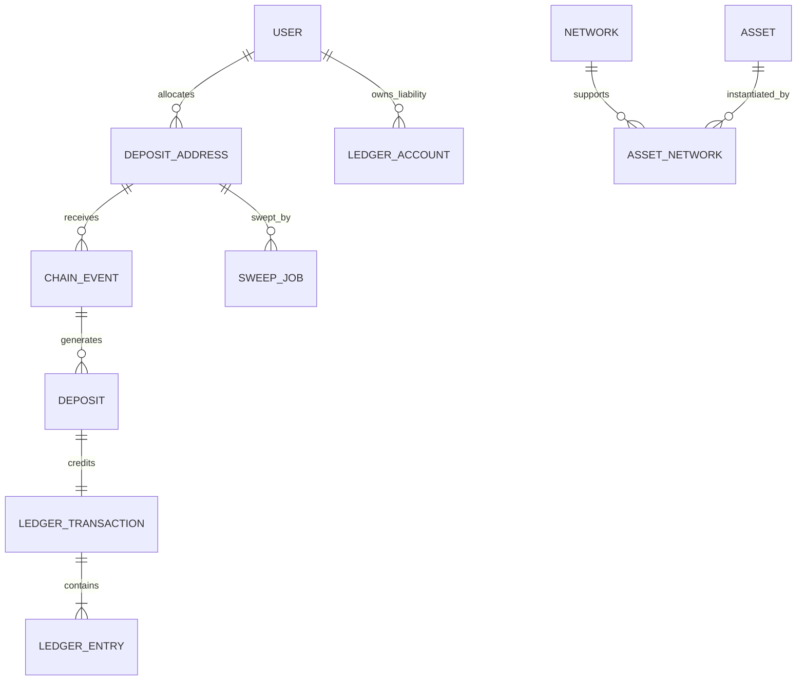

# AegisPay Domain Model

## Core Ubiquitous Language

- **Asset:** An economic asset definition (e.g. `USDT`, `USDC`, `ETH`, `BTC`, `TRX`).
- **Network:** A distinct distributed ledger or blockchain network (e.g. `ethereum-sepolia`, `tron-nile`, `bsc-testnet`).
- **Asset-Network:** The exact manifestation of an Asset on a specific Network, characterized by:
  - Token Contract Address (or native indicator)
  - Decimal precision (immutable integer)
  - Deposit minimum & finality requirement
- **Deposit Address:** A deterministic address assigned to a User on a specific Network.
- **Funding Balance:** Liquid deposited funds credited after finality confirmation, held as a platform liability to the user.
- **Trading Balance:** Funds internally transferred to the trading engine liability account.
- **Treasury Sweep:** On-chain aggregation from a user deposit address to the cold storage vault. (Preserves user liabilities 1:1).

## Entity Relationship Topology

