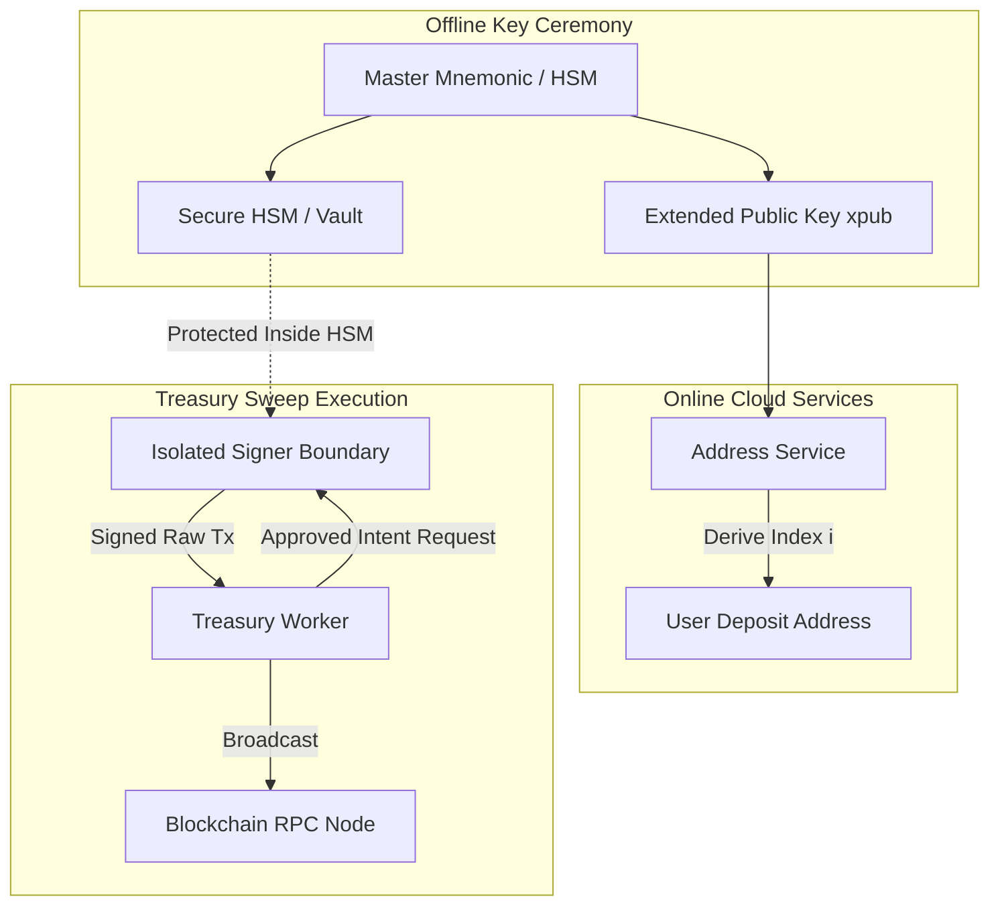

# Key Management & Signing Isolation Architecture

## 1. Architectural Principles
1. **Zero Online Private Keys for Deposits:** The address allocation service holds only the Extended Public Key (xpub) or account derivation public key. It is mathematically impossible to spend funds from the address service.
2. **Cold Storage Segregation:** Cold vault private keys are held entirely offline (Hardware Wallets / Air-gapped multisig). Online systems store only the allowlisted cold storage public address.
3. **Signer Boundary:**
   - Production: Hardware Security Module (HSM), MPC (e.g. Fireblocks, Qredo), or AWS KMS.
   - Development/Testnet: Isolated Mock Signer service running on a separate port with strict testnet-only validation.

## 2. Derivation Standard Paths
- **EVM Networks (Ethereum, BSC):** Standard BIP-44 path `m/44'/60'/0'/0/i`
- **TRON Network:** Standard BIP-44 path `m/44'/195'/0'/0/i`

